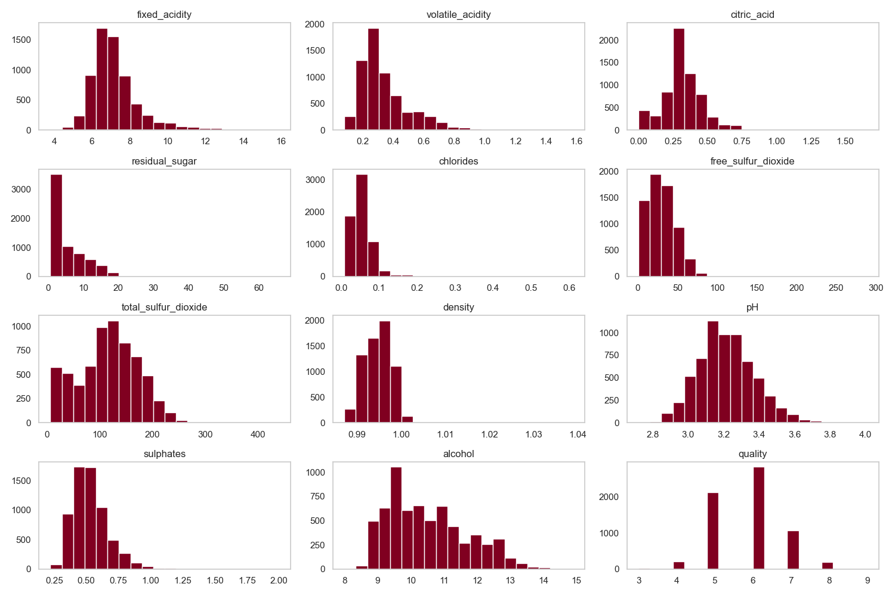
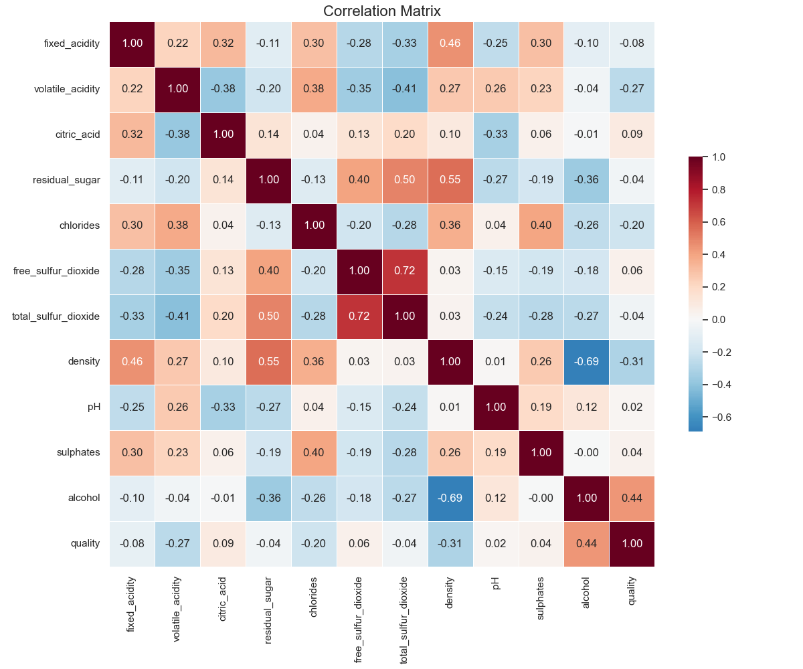
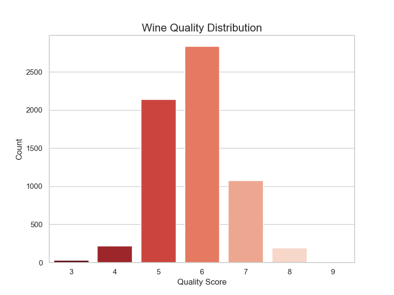

# Wine Quality Prediction Project Report
**Generated on:** 2025-12-11 20:11:40

## 1. Model Performance
The Random Forest model (HistGradientBoostingRegressor) achieved the following performance on the test set:

| Metric | Value |
| :--- | :--- |
| **R² Score** | 0.4514 |
| **RMSE** | 0.6365 |
| **MAE** | 0.4878 |

## 2. Features Used
The model utilized the following 11 input features:
- fixed_acidity
- volatile_acidity
- citric_acid
- residual_sugar
- chlorides
- free_sulfur_dioxide
- total_sulfur_dioxide
- density
- pH
- sulphates
- alcohol

## 3. Exploratory Data Analysis
### Histograms

### Correlation Matrix

### Quality Distribution

---
*Report generated by VinoVeritas Automation System*